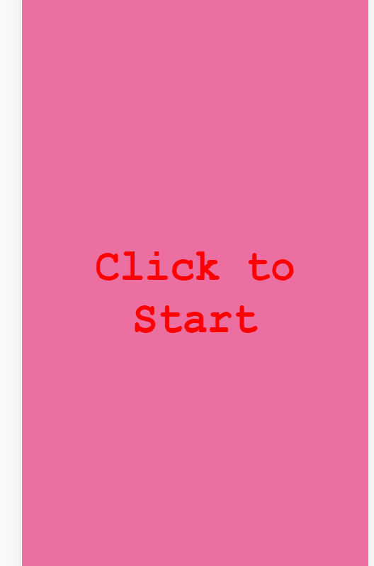
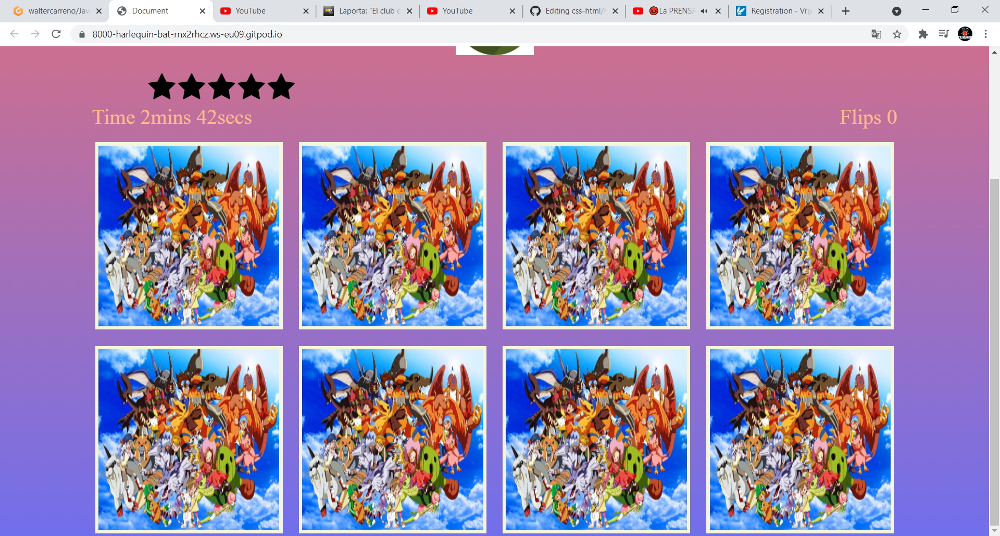
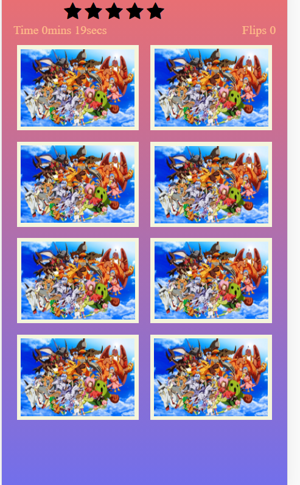
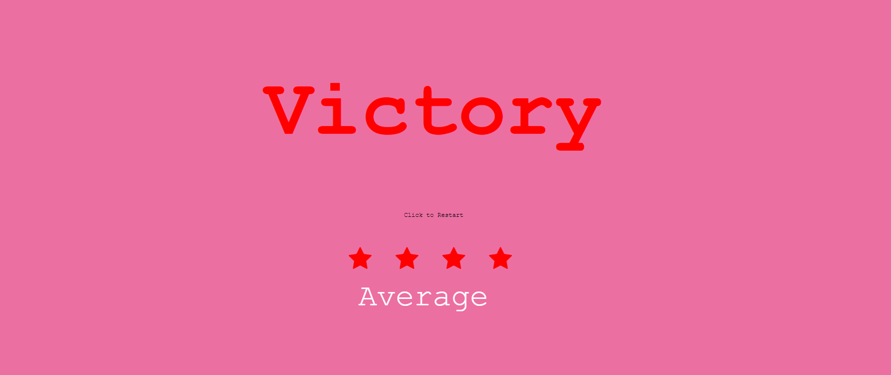
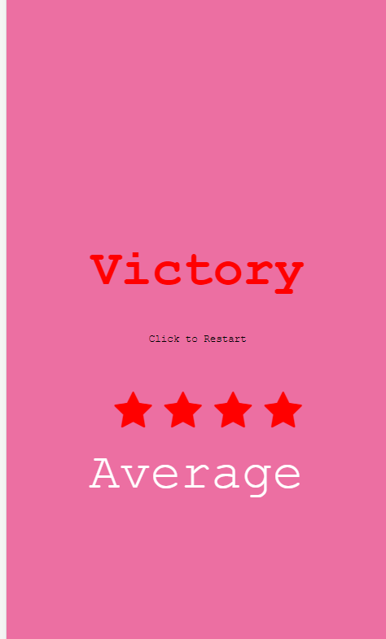
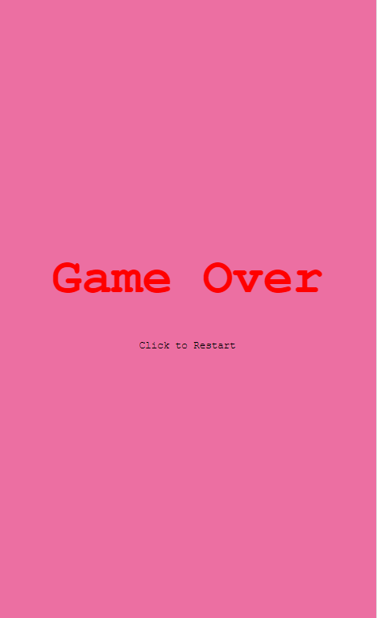
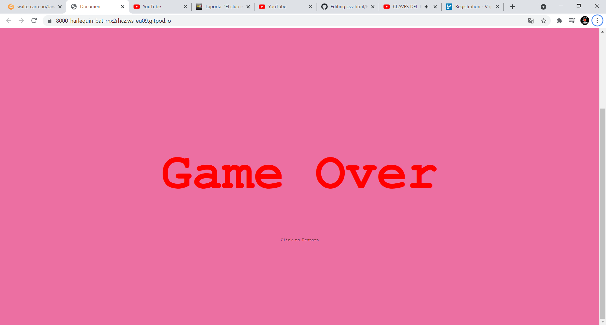

 #  **Welcome to my page.**

 ## **1. Purpose of the project**
With this project I would like to create a memory game that challenges the player.

## **2. User stories**
## Player
As a player, I would like to play  a game that challenges my skills.

As a player, I want to know how I'm performing at the game.

## **3. Features**

The website will consist of 4 pages.

### 3.1 Start game

-An overlay that disappears once is clicked.
 
 ### 3.2 Main game

  - The main game page.
  - 8 cards.
  - Life container.
  - Time counter.
  - Hero image.
  - Title at top of the page.

 ### 3.3 Victory

  -An overlay that disappears once is clicked.
 - An span that score your performance.
 - Stars that disappear depend on the performance.

 ###  3.4 Defeat

  - An overlay that disappears once is clicked.
  - Text to restart.

 
## **4. Typography and color scheme**

### Fonts.

- Titles and headers [Times New Roman](https://www.fonts.com/font/monotype/times-new-roman?QueryFontType=Web&src=GoogleWebFonts) font.

-Overlays [Courier New](https://www.fonts.com/font/monotype/courier-new-os) font.

### Colors

Start game

- Background color of overlay is [#91ec6f](https://www.color-hex.com/color/91ec6f) and the transition changes to [#ec6fa2](color-hex.com/color/ec6fa2)

- De color of text is [rgb((255,0,0))](https://www.color-hex.com/color/ff0000)

Game 

- Background color is [#ec6fa2](color-hex.com/color/ec6fa2)

- H1 is [rgb(0,0,0)](https://www.color-hex.com/color/ff0000)

-Background color from cards is [beige](https://www.color-hex.com/color/f5f5dc)

-[fa-star](https://fontawesome.com/v4.7/icon/star) are [black](https://www.color-hex.com/color/000000) and turn to [red](https://www.color-hex.com/color/ff0000) when there is a missmatched 

Victory

- Background color is [#ec6fa2](color-hex.com/color/ec6fa2)

-[fa-star](https://fontawesome.com/v4.7/icon/star) have a [red](https://www.color-hex.com/color/ff0000)

-H1 is [rgb(0,0,0)](https://www.color-hex.com/color/ff0000)

- [span](https://www.w3schools.com/tags/tag_span.asp) have a [white](color-hex.com/color/ffffff)

-[span](https://www.w3schools.com/tags/tag_span.asp) have a [black](https://www.color-hex.com/color/000000)

Defeat

- Background color is [#ec6fa2](color-hex.com/color/ec6fa2)

-H1 is [rgb(0,0,0)](https://www.color-hex.com/color/ff0000)

-[span](https://www.w3schools.com/tags/tag_span.asp) have a [black](https://www.color-hex.com/color/000000)

## **5. Technology**

- [Css](https://www.w3.org/Style/CSS/Overview.en.html) was used to style the website.
- [Html](https://en.wikipedia.org/wiki/HTML) is the base code for the page.
- [Font awesome](https://fontawesome.com/v4.7.0/icon/bars) is used on life and start container.
- [Google font](https://fonts.google.com/)  is used to style text.
- [Gitpod](https://www.gitpod.io/) is used to deploy the code.
- [Javascript](https://www.javascript.com/) is used as a main code of the page.

## **6. Testing**

  ### 6.1 Start game

  ### Lapton/computer.

  ### Phone.

  ### 6.2 Game
 
 ### Lapton/computer.
 

 ### Phone.

 ### 6.3 Victory

 ### Lapton/computer.
 

 ### Phone.

 ### 6.4 Defeat
 

 ### Lapton/computer.
 

 ### Phone.

## **7. Deployment**
### 7.1 GitHub Pages
The project was deployed to GitHub Pages using the following steps...

1. Log in to GitHub and locate the [GitHub Repository](https://github.com/)
2. At the top of the Repository (not top of page), locate the "Settings" Button on the menu.
3. Scroll down the Settings page until you locate the "GitHub Pages" Section.
4. The page will automatically refresh.
5 .Scroll back down through the page to locate the now published site [link](https://waltercarreno.github.io/css-html/) in the "GitHub Pages" section.

### Forking the GitHub Repository
By forking the GitHub Repository we make a copy of the original repository on our GitHub account to view and/or make changes without affecting the original repository by using the following steps...

1. Log in to GitHub and locate the GitHub Repository
2. At the top of the Repository (not top of page) just above the "Settings" Button on the menu, locate the "Fork" Button.
3. You should now have a copy of the original repository in your GitHub account.

## 10. Credits

Media Images used from Digimon Websites.
I used the following sides as references:

https://github.com/WebDevSimplified

https://github.com/sandraisrael/Memory-Game-fend

https://www.youtube.com/watch?v=AO6etNEl6TA&t=2422s

https://marina-ferreira.github.io/tutorials/js/memory-game/
